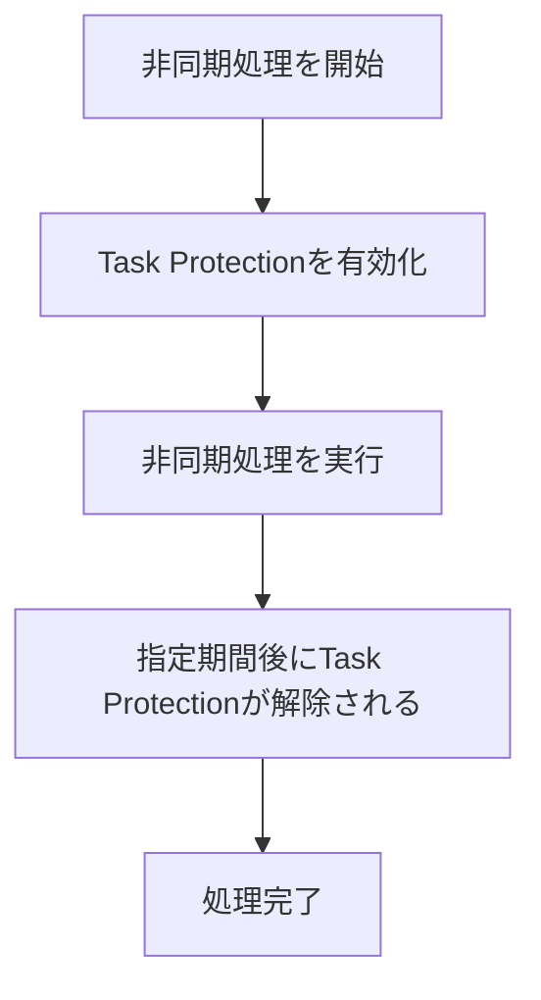
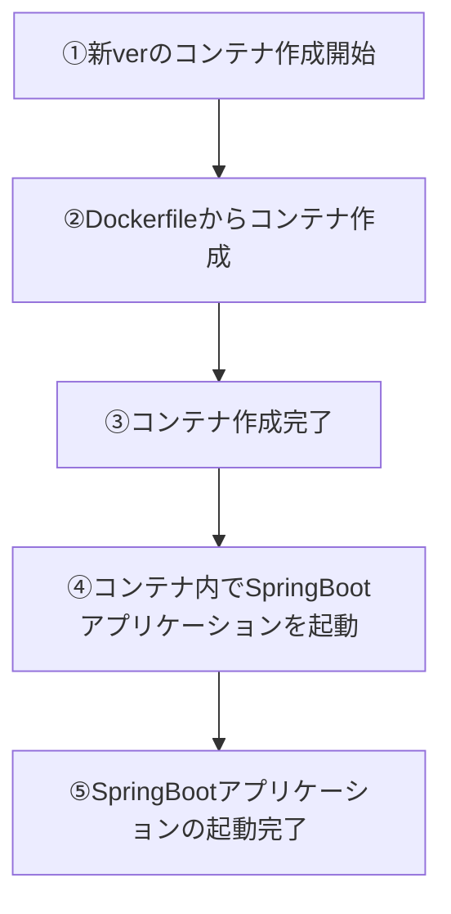

昨今のwebサービスは24/7で稼働することが前提の設計が多いので、リリース時にサービスを止めることなくデプロイする方法が求められます。いわゆる無停止リリースというやつです。
しかし、アプリの実装によっては無停止リリースの実現は簡単ではありません。例えば：

- ステートフルなアプリでは実行途中のプロセスを強制終了することができず、旧バージョンをシャットダウンするタイミングが難しい
- 旧バージョン→新バージョンへアプリが切り替わる際に一瞬の停止時間が存在し、そのタイミングに受信したリクエストが5xxエラーを引いてしまう

こういう事情がある場合、単にRolling UpdateやB/G Deploymentを採用するだけではうまくいきません。運の悪いユーザーが5xxエラーに遭遇しないようにケアしてやる必要があります。この記事では、具体的なケアについて深掘りしていきます。

なお、今回は以下の構成図のようなSpringBoot on ECSなアプリケーションの場合に絞ってみていきます。（私が経験したのがこのような構成だったので）一つのALBに対して複数のECSタスクがあるようなケースを考えます。

ここに図

## 無停止リリースを阻む課題
先ほども挙げましたが無停止リリースには以下の課題があります。

- 実行途中のプロセスが全て完了してから旧verアプリをシャットダウンする必要がある
- 旧verをシャットダウン→新verを起動の時にアプリのダウンタイムが一瞬発生する

前者はGraceful Shutdown、後者はRolling Updateでそれぞれ対処していきます。


## Graceful Shutdown
Graceful Shutdownとは、進行中のプロセスを中断することなくシャットダウンすることです。

（graceful＝優しい・優雅などの意味をもつ形容詞です）

Windows・MacのPCをシャットダウンを開始すると、開いているアプリケーションをOSが一つずつ安全に終了させてからシャットダウンが始まりますよね。あれと同じです。

Graceful Shutdownの具体的なステップは以下です。

- 新規リクエストの受付を停止する
- 進行中のプロセスが全て完了するまで待機する
- シャットダウンを実行する

Graceful　ShutdownをSpringBoot on ECSなアプリで実現する場合、いくつかの設定が必要です。

### SpringBootの仕様
SpringBootでは、明示的に無効化しない限りデフォルトでGraceful Shutdownが有効化されています。application.yamlにある以下の設定が該当します。
```yaml
server:
  shutdown: graceful # Graceful Shutdownを適用

spring:
  lifecycle:
    timeout-per-shutdown-phase: 30s # 進行中のプロセスを30秒待つ
```

どちらのプロパティもデフォルト値が`graceful`, `30s`になっています。

デフォルトの設定では、30秒以内に完了するプロセスはGraceful Shutdownの対象となります。30秒を超過する処理は中断されます。

こう書くと「じゃあSpringBoot使ってる場合は特に何もしなくてもGraceful Shutdown機能が使えるのね！」と思うかもしれませんが、実はそうではありません。この設定にはいくつか注意点があります。

1. `@Async`などの非同期処理はGraceful Shutdownの待機プロセスの対象とならない。
    - 非同期処理としてバックグラウンドで進行中のプロセスはシャットダウンとともに強制的に中断されてしまう
    - （こちらの対策は後述します）
2. `timeout-per-shutdown-phase`の値を短すぎず長すぎない値に調整する必要がある
    - 短すぎるとプロセスが完了しないし、長すぎるとデプロイ時間が間延びする。
    - アプリの特性を理解し、何秒待つのが最適なのかを正確に見積もる必要がある。
3. SIGTERMを受け取った時にGraceful Shutdownが実行される
    - SIGKILLを受け取った場合はGraceful Shutdownは適用されません（それはそう）

一つ目の非同期処理のプロセス保護については、次項のECS Task Scale-in Protectionで対処していきます。

- ref: https://spring.pleiades.io/spring-boot/appendix/application-properties/
- ref: https://docs.spring.io/spring-boot/reference/web/graceful-shutdown.html


### ECS Task Scale-in Protection
前項で述べた非同期処理のプロセス保護は、ECS Task Scale-in Protectionという機能を使います。

これは、ECSタスクがスケールインやデプロイによってシャットダウンされる時に、対象のタスクをシャットダウンから保護する仕組みです。指定された時間分だけシャットダウンを待機することができます。

利用するにはECSタスクロールに以下の2つのロールが必要になります。
```json
        "ecs:GetTaskProtection",
        "ecs:UpdateTaskProtection"
```

ただし全ての非同期処理に対して自動的に保護してくれるわけではありません。
保護対象のプロセスはアプリケーション側で明示的に指定が必要です。フローはざっくりこんな感じ。




上記フローを踏まえたサンプルコードはこちらです。

```java
import java.util.Map;
import java.util.concurrent.CompletableFuture;
import org.springframework.beans.factory.annotation.Value;
import org.springframework.http.MediaType;
import org.springframework.scheduling.annotation.Async;
import org.springframework.stereotype.Service;
import org.springframework.web.client.RestClient;
/**
 * Executes an asynchronous process while protecting the ECS task
 * from scale-in termination.
 */
@Service
public final class AsyncJobService {
    private final RestClient restClient;
    private final String taskProtectionEndpoint;
    /**
     * Creates the service.
     *
     * @param restClientBuilder the REST client builder
     * @param ecsAgentUri the ECS container agent URI
     */
    public AsyncJobService(
        final RestClient.Builder restClientBuilder,
        @Value("${ECS_AGENT_URI}") final String ecsAgentUri
    ) {
        this.restClient = restClientBuilder.build();
        this.taskProtectionEndpoint =
            ecsAgentUri + "/task-protection/v1/state";
    }
    /**
     * Executes an asynchronous process with ECS task protection enabled.
     *
     * @return a future completed when the process finishes
     */
    @Async
    public CompletableFuture<Void> executeAsync() {
        updateTaskProtection(true);
        // Execute the asynchronous process here.
        return CompletableFuture.completedFuture(null);
    }
    /**
     * Updates the scale-in protection status of the current ECS task.
     *
     * @param enabled whether task protection should be enabled
     */
    private void updateTaskProtection(final boolean enabled) {
        final Map<String, Object> requestBody = enabled
            ? Map.of(
                "ProtectionEnabled", true,
                "ExpiresInMinutes", 60
            )
            : Map.of("ProtectionEnabled", false);
        restClient.put()
            .uri(taskProtectionEndpoint)
            .contentType(MediaType.APPLICATION_JSON)
            .body(requestBody)
            .retrieve()
            .toBodilessEntity();
    }
}
```

`ECS_AGENT_URI`の環境変数に入るURIはECSが自動で注入してくれます。
保護したい非同期処理の開始前に`ECS_AGENT_URI`へタスク保護を指示するリクエストを送信します。

注意点として、 **タスク保護はプロセス単位で設定することはできません。** タスク単位での保護になります。

保護したい非同期処理が10個あった場合、10個それぞれに保護を適用することはできません。1つ目の処理が開始されたらそこから60秒間保護が始まり、1つ目の10秒後に2つ目の処理が開始されたらまた保護を開始し、保護期間はそこから60秒間に上書きされます。なので、結果的に最後に到着した10個目の処理が開始されてから60秒間の間保護が適用される形になります。

ref: https://docs.aws.amazon.com/AmazonECS/latest/developerguide/task-scale-in-protection.html

## Rolling Update
ECS側でRollingUpdateを有効化しましょう。

Rolling Updateとは、旧バージョンのコンテナが稼働している裏で新バージョンのコンテナを1つずつ起動していき、起動したコンテナから順にトラフィックを旧から新に徐々に切り替えていく手法です。「新コンテナを1つ起動したら旧コンテナを1つシャットダウンする」を繰り返していくイメージです。

詳しくはこちら：

https://qiita.com/tttol777/items/5f5a3ba16009b4fa6bd3

ECSのデプロイ戦略は、何も指定しなければ最初から`ROLLING`になっているはずなのでデフォルトの設定をそのまま使っていればRolling Updateは有効になっています。明示的に設定する場合は以下のようにstrategyにROLLINGを指定しましょう。

```sh
aws ecs update-service \
  --cluster my-cluster \
  --service my-service \
  --deployment-configuration '{"strategy":"ROLLING"}'
```


## Health Check
Rolling Updateを設定する際は、コンテナのヘルスチェックにも気を配りましょう。

新しいコンテナが作成されそのコンテナの起動が完了したかどうかを判断するには、ヘルスチェックの結果が用いられます。ECS上でSpringBootアプリを稼働させるなら、コンテナ起動後に **SpringBootアプリのjarが起動し8080ポートでリクエストの受付が可能になって初めてコンテナがhealthyと判断できます。**



ですが、ALB/ECSコンテナのデフォルトの設定のヘルスチェックでは③の時点でhealthyとみなすようになっています。

このままではSpringBootアプリが起動していないにも関わらずリクエストがコンテナに到達してしまい、クライアントにHTTP 5xxエラーを返してしまう恐れがあります。⑤まで待ってもらうように、ヘルスチェックの実装と設定を更新しましょう。

### アプリでヘルスチェックを実装する
SpringBootにはヘルスチェックを簡単に実装できるSpring Boot Actuatorというライブラリがあります。

```gradle
dependencies {
    implementation("org.springframework.boot:spring-boot-starter-actuator")
}
```

上記をbuild.gradleに記載後、`GET http://localhost:8080/actuator/health`にアクセスするとアプリの稼働状況を確認することが可能です。

### ALB/ECSのヘルスチェック設定を更新する
ALBからECSへ通信を行う場合、ALBのターゲットグループに先ほどのActuatorのヘルスチェックエンドポイントを設定します。

```sh
aws elbv2 modify-target-group \
  --target-group-arn  ターゲットグループのARN \
  --health-check-protocol HTTP \
  --health-check-port traffic-port \
  --health-check-path /health \
  --health-check-interval-seconds 30 \
  --health-check-timeout-seconds 5 \
  --healthy-threshold-count 2 \
  --unhealthy-threshold-count 2 \
  --matcher 'HttpCode=200'
```

- health-check-port: traffic-portならECSコンテナへ転送するポートを使用
- health-check-path: アプリケーションのヘルスチェックパス
- matcher: 正常と判定するHTTPステータス。通常は200を推奨
- healthy-threshold-count: 正常へ戻すまでの連続成功回数
- unhealthy-threshold-count: 異常と判断するまでの連続失敗回数

ECS Serivice DiscoveryでECSタスク間の通信を行っている場合は、ECSのタスク定義からヘルスチェックエンドポイントを設定します。

```json
      "healthCheck": {
        "command": [
          "CMD-SHELL",
          "curl -f http://localhost:8080/actuator/health || exit 1"
        ],
        "interval": 30,
        "timeout": 5,
        "retries": 3,
        "startPeriod": 60
      }
```

- command
    - コンテナ内で実行するヘルスチェックコマンドです。
    - CMD-SHELLは、シェル経由でコマンドを実行します。||などのシェル構文を利用できます。
    - curl -fはHTTP 400以上の場合に失敗終了します。
    - 終了コード0なら正常、それ以外なら異常です。
- interval
    - ヘルスチェックを30秒間隔で実行します。
- timeout
    - 5秒以内にコマンドが完了しなければ、そのヘルスチェックを失敗と判断します。
- retries
    - 3回連続で失敗すると、コンテナをUNHEALTHYと判断します。
    - ECSサービス配下なら、基本的に異常なタスクは停止され、新しいタスクに置き換えられます。
- startPeriod
    - コンテナ起動後60秒間の起動猶予期間です。
    - この期間中の失敗はretriesにカウントされません。

## 余談: ECSタスク間通信
ECS Service Discovery
Cloud Map

## まとめ 
無停止リリースはアプリ・インフラの実装によっては実現までのハードルが高くなりがちです。しかし、実現できると運用負荷が激減するので、面倒がらずに取り組みたいところです。
