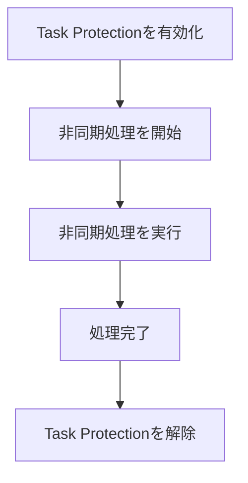
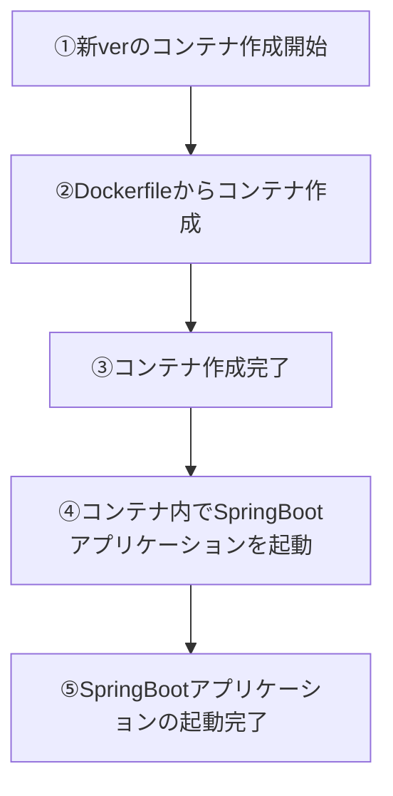

昨今のwebサービスは24/7で稼働することが前提の設計が多いので、リリース時にサービスを止めることなくデプロイする方法が求められます。いわゆる無停止リリースというやつです。
しかし、アプリの実装によっては無停止リリースの実現は簡単ではありません。例えば：

- ステートフルなアプリでは実行途中のプロセスを強制終了することができず、旧バージョンをシャットダウンするタイミングが難しい
- 旧バージョン→新バージョンへアプリが切り替わる際に一瞬の停止時間が存在し、そのタイミングに受信したリクエストが5xxエラーを引いてしまう

こういう事情がある場合、単にRolling UpdateやB/G Deploymentを採用するだけではうまくいきません。運の悪いユーザーが5xxエラーに遭遇しないようにケアしてやる必要があります。この記事では、具体的なケアについて深掘りしていきます。

なお、今回は以下の構成図のようなECS上で稼働させるJavaアプリケーションをみていきます。（私が経験したのがこのような構成だったので）一つのALBに対して複数のECSタスクがあるようなケースを考えます。


## 無停止リリースを阻む課題
先ほども挙げましたが無停止リリースには以下の課題があります。

- 実行途中のプロセスが全て完了してから旧verアプリをシャットダウンする必要がある
- 旧verをシャットダウン→新verを起動の時にアプリのダウンタイムが一瞬発生する

前者はGraceful Shutdown、後者はRolling Updateでそれぞれ対処していきます。


## Graceful Shutdown
Graceful Shutdownとは、進行中のプロセスを中断することなくシャットダウンすることです。

（graceful＝優しい・優雅などの意味をもつ形容詞です）

Windows・MacのPCをシャットダウンを開始すると、開いているアプリケーションをOSが一つずつ安全に終了させてからシャットダウンが始まりますよね。あれと同じです。

Graceful Shutdownの具体的なステップは以下です。

- 新規リクエストの受付を停止する
- 進行中のプロセスが全て完了するまで待機する
- シャットダウンを実行する

Graceful ShutdownをSpringBoot on ECSなアプリで実現する場合、いくつかの設定が必要です。

### Spring Bootの仕様
Spring Boot 3.4以降では、明示的に無効化しない限りデフォルトでGraceful Shutdownが有効化されています。Spring Boot 3.3以前ではデフォルトが異なるため、バージョンに依存せず動作を明確にするなら、以下の設定を明示しておくと安全です。
```yaml
server:
  shutdown: graceful # Graceful Shutdownを適用

spring:
  lifecycle:
    timeout-per-shutdown-phase: 30s # 停止フェーズごとの待機上限
```

Spring Boot 3.4以降では、どちらのプロパティもデフォルト値が`graceful`, `30s`になっています。

`timeout-per-shutdown-phase`は任意のバックグラウンド処理を30秒間保護する設定ではなく、同じフェーズに属する`SmartLifecycle` Beanの停止を待機するタイムアウトです。WebサーバーのGraceful Shutdownでは、タイムアウト内は処理中のリクエストの完了を待ち、新規リクエストを受け付けません。タイムアウトを超えると、Webサーバーは即時シャットダウンへ移行します。

こう書くと「じゃあSpringBoot 3.4+を使ってる場合は特に何もしなくてもGraceful Shutdown機能が使えるのね！」と思うかもしれませんが、実はそうではありません。この設定にはいくつか注意点があります。

1. `@Async`などの非同期処理は、WebサーバーのGraceful Shutdownだけでは完了を保証できない。
    - 長時間の非同期処理は、後述するECS Task Scale-in Protectionが必要
2. `timeout-per-shutdown-phase`の値を短すぎず長すぎない値に調整する必要がある
    - 短すぎるとプロセスが完了しないし、長すぎるとデプロイ時間が間延びする。
    - アプリの特性を理解し、何秒待つのが最適なのかを正確に見積もる必要がある。
3. SIGTERMを受け取った時にGraceful Shutdownが実行される
    - SIGKILLを受け取った場合はGraceful Shutdownは適用されません（それはそう）


非同期処理のプロセス保護については、次項のECS Task Scale-in Protectionで対処していきます。

また、ECSはタスク停止時にSIGTERMを送信し、停止タイムアウトを過ぎるとSIGKILLで強制終了します。デフォルトの停止タイムアウトも30秒なので、Spring Boot側と両方を30秒にすると、Spring Bootの終了処理が完了する前にSIGKILLされる可能性があります。例えばSpring Boot側を30秒にする場合は、ECSタスク定義のコンテナ定義で`stopTimeout`を60秒に設定します。

```json
{
  "stopTimeout": 60
}
```
- ref: https://spring.pleiades.io/spring-boot/appendix/application-properties/
- ref: https://docs.spring.io/spring-boot/reference/web/graceful-shutdown.html
- ref: https://github.com/spring-projects/spring-boot/wiki/Spring-Boot-3.4-Release-Notes
- ref: https://docs.aws.amazon.com/cli/latest/reference/ecs/stop-task.html


### ECS Task Scale-in Protection
前項で述べた非同期処理のプロセス保護は、ECS Task Scale-in Protectionという機能を使います。

これは、ECSタスクがスケールインやデプロイによってシャットダウンされる時に、対象のタスクをシャットダウンから保護する仕組みです。指定された時間分だけシャットダウンを待機することができます。

利用するにはECSタスクロールに以下の2つのロールが必要になります。
```json
        "ecs:GetTaskProtection",
        "ecs:UpdateTaskProtection"
```

ただし全ての非同期処理に対して自動的に保護してくれるわけではありません。
保護対象のプロセスはアプリケーション側で明示的に指定が必要です。フローはざっくりこんな感じ。




上記フローを踏まえたサンプルコードはこちらです。

```java
import java.util.Map;
import java.util.concurrent.CompletableFuture;
import org.springframework.beans.factory.annotation.Value;
import org.springframework.http.MediaType;
import org.springframework.scheduling.annotation.Async;
import org.springframework.stereotype.Service;
import org.springframework.web.client.RestClient;
/**
 * Executes an asynchronous process while protecting the ECS task
 * from scale-in termination.
 */
@Service
public final class AsyncJobService {
    private final RestClient restClient;
    private final String taskProtectionEndpoint;
    private final Object taskProtectionLock = new Object();
    private int activeJobCount;
    /**
     * Creates the service.
     *
     * @param restClientBuilder the REST client builder
     * @param ecsAgentUri the ECS container agent URI
     */
    public AsyncJobService(
        final RestClient.Builder restClientBuilder,
        @Value("${ECS_AGENT_URI}") final String ecsAgentUri
    ) {
        this.restClient = restClientBuilder.build();
        this.taskProtectionEndpoint =
            ecsAgentUri + "/task-protection/v1/state";
    }
    /**
     * Executes an asynchronous process with ECS task protection enabled.
     *
     * @return a future completed when the process finishes
     */
    @Async
    public CompletableFuture<Void> executeAsync() {
        startProtectedJob();
        try {
            // Execute the asynchronous process here.
            return CompletableFuture.completedFuture(null);
        } finally {
            finishProtectedJob();
        }
    }
    /**
     * Starts a job and enables protection before the first active job.
     */
    private void startProtectedJob() {
        synchronized (taskProtectionLock) {
            if (activeJobCount == 0) {
                updateTaskProtection(true);
            }
            activeJobCount++;
        }
    }
    /**
     * Finishes a job and disables protection after the last active job.
     */
    private void finishProtectedJob() {
        synchronized (taskProtectionLock) {
            activeJobCount--;
            if (activeJobCount == 0) {
                updateTaskProtection(false);
            }
        }
    }
    /**
     * Updates the scale-in protection status of the current ECS task.
     *
     * @param enabled whether task protection should be enabled
     */
    private void updateTaskProtection(final boolean enabled) {
        final Map<String, Object> requestBody = enabled
            ? Map.of(
                "ProtectionEnabled", true,
                "ExpiresInMinutes", 60
            )
            : Map.of("ProtectionEnabled", false);
        restClient.put()
            .uri(taskProtectionEndpoint)
            .contentType(MediaType.APPLICATION_JSON)
            .body(requestBody)
            .retrieve()
            .toBodilessEntity();
    }
}
```

`ECS_AGENT_URI`の環境変数に入るURIはECSが自動で注入してくれます。
保護したい非同期処理の開始前に`ECS_AGENT_URI`へタスク保護を指示するリクエストを送信します。

注意点として、 **タスク保護はプロセス単位で設定することはできません。** タスク単位での保護になります。

サンプルでは同一タスク内の実行中ジョブ数を管理し、最初のジョブの開始前に保護を有効化し、最後のジョブの完了後に解除しています。単純に各処理の`finally`で解除すると、先に完了した処理が、まだ実行中の別処理の保護まで解除してしまうためです。

`ExpiresInMinutes`は処理完了後に解除する代わりではなく、解除漏れに対する上限です。処理が有効期限を超える可能性がある場合は、処理時間に合わせた期限を設定するか、保護を定期的に更新する必要があります。

Task Protectionが有効な旧タスクは、保護が解除または期限切れになるまでデプロイで停止されません。HTTPリクエストから非同期処理を起動し続ける構成では、旧タスクへ新しい処理が入り続けてデプロイが完了しない可能性があります。デプロイ開始後に新しい非同期処理を受け付けない仕組みが必要です。

ref: https://docs.aws.amazon.com/AmazonECS/latest/developerguide/task-scale-in-protection.html

## Rolling Update
ECS側でRollingUpdateを有効化しましょう。

Rolling Updateとは、旧バージョンのコンテナを新バージョンのコンテナへ段階的に置き換える手法です。新旧タスクを同時にいくつ稼働させるかは、ECSサービスの`minimumHealthyPercent`、`maximumPercent`、`desiredCount`によって決まります。そのため、必ず1タスクずつ起動・停止するわけではありません。

ECSサービスのデフォルトのデプロイ戦略は`ROLLING`です。明示的に設定する場合は、可用性を維持するための割合も合わせて指定します。以下の例では、稼働中のhealthyなタスク数を`desiredCount`以上に保ちつつ、一時的に最大2倍までタスクを起動できます。

```sh
aws ecs update-service \
  --cluster my-cluster \
  --service my-service \
  --deployment-configuration \
    '{"strategy":"ROLLING","minimumHealthyPercent":100,"maximumPercent":200}'
```

例えば`desiredCount`が1でも、`maximumPercent`が200なら、新タスクを1つ起動してhealthyになった後に旧タスクを停止できます。

ref: https://docs.aws.amazon.com/AmazonECS/latest/developerguide/deployment-type-ecs.html

## Health Check
Rolling Updateを設定する際は、コンテナのヘルスチェックにも気を配りましょう。

新しいコンテナが作成されそのコンテナの起動が完了したかどうかを判断するには、ヘルスチェックの結果が用いられます。ECS上でSpringBootアプリを稼働させるなら、コンテナ起動後に **SpringBootアプリのjarが起動し8080ポートでリクエストの受付が可能になって初めてコンテナがhealthyと判断できます。**



ですが、ALB/ECSコンテナのデフォルトの設定のヘルスチェックでは③の時点でhealthyとみなすようになっています。

このままではSpringBootアプリが起動していないにも関わらずリクエストがコンテナに到達してしまい、クライアントにHTTP 5xxエラーを返してしまう恐れがあります。⑤まで待ってもらうように、ヘルスチェックの実装と設定を更新しましょう。

### アプリでヘルスチェックを実装する
SpringBootにはヘルスチェックを簡単に実装できるSpring Boot Actuatorというライブラリがあります。

```gradle
dependencies {
    implementation("org.springframework.boot:spring-boot-starter-actuator")
}
```

上記をbuild.gradleに記載後、`GET http://localhost:8080/actuator/health`にアクセスするとアプリの稼働状況を確認することが可能です。

### ALB/ECSのヘルスチェック設定を更新する
ALBからECSへ通信を行う場合、ALBのターゲットグループに先ほどのActuatorのヘルスチェックエンドポイントを設定します。

```sh
aws elbv2 modify-target-group \
  --target-group-arn  ターゲットグループのARN \
  --health-check-protocol HTTP \
  --health-check-port traffic-port \
  --health-check-path /actuator/health \
  --health-check-interval-seconds 30 \
  --health-check-timeout-seconds 5 \
  --healthy-threshold-count 2 \
  --unhealthy-threshold-count 2 \
  --matcher 'HttpCode=200'
```

- health-check-port: traffic-portならECSコンテナへ転送するポートを使用
- health-check-path: アプリケーションのヘルスチェックパス
- matcher: 正常と判定するHTTPステータス。通常は200を推奨
- healthy-threshold-count: 正常へ戻すまでの連続成功回数
- unhealthy-threshold-count: 異常と判断するまでの連続失敗回数

ECS Serivice DiscoveryでECSタスク間の通信を行っている場合は、ECSのタスク定義からヘルスチェックエンドポイントを設定します。

```json
      "healthCheck": {
        "command": [
          "CMD-SHELL",
          "curl -f http://localhost:8080/actuator/health || exit 1"
        ],
        "interval": 30,
        "timeout": 5,
        "retries": 3,
        "startPeriod": 60
      }
```

- command
    - コンテナ内で実行するヘルスチェックコマンドです。
    - CMD-SHELLは、シェル経由でコマンドを実行します。||などのシェル構文を利用できます。
    - curl -fはHTTP 400以上の場合に失敗終了します。
    - 終了コード0なら正常、それ以外なら異常です。
- interval
    - ヘルスチェックを30秒間隔で実行します。
- timeout
    - 5秒以内にコマンドが完了しなければ、そのヘルスチェックを失敗と判断します。
- retries
    - 3回連続で失敗すると、コンテナをUNHEALTHYと判断します。
    - ECSサービス配下なら、基本的に異常なタスクは停止され、新しいタスクに置き換えられます。
- startPeriod
    - コンテナ起動後60秒間の起動猶予期間です。
    - この期間中の失敗はretriesにカウントされません。

## 余談: ECS Service Discovery
今回色々調べていく中で、個人的に初見だったサービスです。
ECS Service Discoveryとは、変動するECSタスクのIPアドレスを固定のサービス名で発見できるようにする仕組みです。DNS的にコンテナのアドレスを扱えるわけです。IPとサービス名の組をを管理する基盤はAWS Cloud Mapといいます。

```
ECS Service
  ├─ Task: 10.0.1.10
  ├─ Task: 10.0.2.20
  └─ Task: 10.0.3.30
          │ 自動登録・解除
          ▼
AWS Cloud Map
  Namespace: internal.local
  Service: payment
          │
          ▼
payment.internal.local
  → 10.0.1.10
  → 10.0.2.20
  → 10.0.3.30
```

Cloud MapはECS固有の機能ではなく、EC2などでも利用できる汎用サービスのようです。

## まとめ 
無停止リリースはアプリ・インフラの実装によっては実現までのハードルが高くなりがちです。しかし、実現できると運用負荷が激減するので、面倒がらずに取り組みたいところです。
